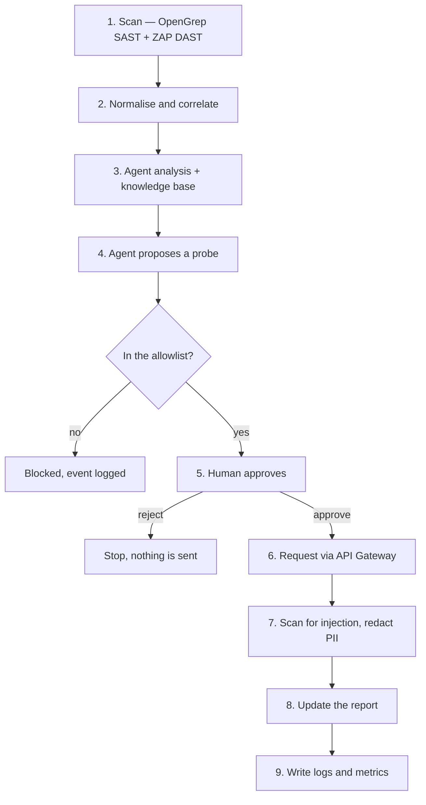

# Project Sentinel

An AI-assisted security triage pipeline for web applications. It runs SAST and DAST against
[OWASP WebGoat](https://owasp.org/www-project-webgoat/), normalises both into one finding
format, has an LLM agent explain and prioritise them against a curated knowledge base, and
lets that agent propose one verification request — which a human must approve before it is
sent through an API Gateway that independently re-checks it.

**The point is not that an LLM is involved. The point is that the LLM's output is treated as
untrusted data and clamped by deterministic checks.** Four layers reject a model response
that invents a finding ID, alters a source excerpt, writes an exploit payload, or claims
more than its evidence supports.

---

## Table of contents

- [How it works](#how-it-works)
- [Quick start](#quick-start)
- [Verifying it works](#verifying-it-works)
- [Results from a real run](#results-from-a-real-run)
- [Security model](#security-model)
- [Command reference](#command-reference)
- [Knowledge base](#knowledge-base)
- [Known limitations](#known-limitations)
- [Repository layout](#repository-layout)

---

## How it works

Nine steps, one command, one mandatory stop for a human.



Steps 1–4 send nothing outbound except to the LLM, and everything reaching the LLM is
redacted first. Step 5 defaults to **reject**: anything other than typing `approve` stops
the run. Only steps 6–9 produce real traffic, and it goes through the Gateway, never
directly to the target.

---

## Quick start

### Prerequisites

| Requirement | Notes |
| :--- | :--- |
| Python 3.10+ | CI uses 3.12 |
| Docker Engine + Compose v2 | Runs WebGoat, both Gateway lanes, ZAP, and the web UI |
| `git`, `curl`, `jq`, `openssl` | Available on the host |
| An LLM API key | OpenRouter by default; needed only for the analysis step |
| Outbound network | First container build, and live LLM calls |

### 1. Clone and install

```bash
git clone --recurse-submodules <repository-url>
cd project-sentinel

python3 -m venv .venv
source .venv/bin/activate
python -m pip install --upgrade pip
python -m pip install -r requirements.txt
```

`requirements.txt` is the locked, pip-compatible export of `uv.lock` and installs this
repository in editable mode. If you cloned without `--recurse-submodules`, run
`git submodule update --init --recursive` — WebGoat's source is the SAST target.

### 2. Configure

```bash
cp .env.example .env
# Edit .env and set LLM_API_KEY. Everything else has a working default.
```

`.env` is gitignored, and its contents are redacted before reaching any report or log.

### 3. Start the system

```bash
make up
```

This builds and starts five containers: WebGoat, the Gateway probe lane, the Gateway DAST
lane, the ZAP daemon, and the web UI. Gateway credentials are generated fresh with
`openssl rand -hex 32` on every `make up` — never written to Git, never printed.

- Web UI: <http://127.0.0.1:8000>
- Gateway: <http://127.0.0.1:9080> — returns `401` without a key, which is correct

### 4. Run the pipeline

```bash
make run
```

The run stops at the approval gate and asks you. Type `approve` to allow the request, or
anything else to reject it. Expect roughly **6 minutes**; the analysis step is about 97 % of
that, because it makes around 40 LLM calls.

When it finishes, read `artifacts/runs/<run-id>/report.md`.

### 5. Shut down

```bash
make down
```

---

## Verifying it works

Run these in order on a fresh clone. Everything except `make eval` works without an LLM key.

```bash
make quality        # ruff + mypy + tests + coverage gate + dependency audit
make agent-test     # tests against the real Gateway and WebGoat containers
make eval           # 13-case agent evaluation, needs LLM_API_KEY
```

Expected on the reference environment:

| Command | Expected result | Time |
| :--- | :--- | ---: |
| `make quality` | **1051 passed**, coverage **83.8 %** against a 78 % gate, no known vulnerabilities | ~40 s |
| `make agent-test` | all green, including real Gateway policy enforcement | ~35 s |
| `make eval` | **13/13 cases**, 39/39 samples across 3 repeats | ~5 min |

If `make quality` is green, the code is sound. If `make agent-test` is green, the Gateway is
enforcing its policy for real rather than in a mock.

---

## Results from a real run

Every figure below comes from run `20260823T111417Z` — a complete nine-step run in Docker,
with a real LLM and a human typing `approve`. Reproduce with `make up && make run`, then
compare against `artifacts/runs/<run-id>/metrics.json`.

| Measure | Value |
| :--- | ---: |
| Raw findings | **37** — 23 SAST + 14 DAST |
| Analysis records produced | **34 of 37** finding groups |
| SAST findings proven reachable through the Gateway | **17 of 23** |
| Requests sent through the Gateway | **1**, denied **0** |
| Approved by | `cli-operator` — a human |
| LLM / application errors | **0 / 0** |
| Total wall time | **355 s** |

Two numbers deserve emphasis, both unflattering.

**Recall is 18.7 %.** The scanner reaches 14 of the 75 known vulnerabilities in WebGoat,
because the rule set contains only three rules. High precision on top of low recall only
means *"what it happens to find, it reads reasonably well."* **Do not treat "nothing found"
as evidence that code is clean.**

**Three of 37 finding groups produced no record.** The model returned output that failed
schema or provenance validation, and after one retry the group was dropped — those findings
are absent from the final report. The run is marked `PARTIAL`, not `COMPLETE`, and the
reasons are recorded in `analysis-summary.json`.

Full analysis, including per-dimension agent accuracy and the ground-truth comparison:
[`reports/week-06/report.md`](reports/week-06/report.md).

---

## Security model

### The target is deliberately vulnerable

WebGoat contains real, exploitable vulnerabilities. It runs on an internal Docker network
and **is never published to a host port**. Only the Gateway's probe lane binds a host port,
and only to loopback. Thirteen tests lock this; changing the compose networking to expose
WebGoat on `0.0.0.0` fails the suite.

### Two independent Gateway lanes

| Lane | Address | Used by | Policy |
| :--- | :--- | :--- | :--- |
| Probe | `127.0.0.1:9080` | The agent's approved verification request | Exact template match — one endpoint, one payload shape |
| DAST | internal only | The ZAP scanner | Broader crawl, but request bodies are replaced with Gateway-chosen constants |

Both lanes are deny-by-default. The allowlist exists in **two independently written layers**:
a JSON file the Python side reads, and nginx `map` directives the Gateway reads. Neither is
generated from the other, so a mistake in one cannot silently propagate to the other.

### Four guardrail chokepoints

Each sits where every code path must pass, so no caller can forget it:

```text
build_llm()   ──> RedactingProvider    # nothing reaches an external model unredacted
log_request() ──> redact_structure()   # nothing reaches disk unredacted
send_probe()  ──> requires_approval()  # POST or unusual payload needs a human
send_probe()  ──> redact() on the way out
```

### Application output is untrusted by default

Anything the target returns is scanned for injection patterns, stripped of embedded
instructions, redacted, and wrapped in `<untrusted_app_response>` tags before any model
sees it.

### Four layers that reject bad model output

| Layer | Rejects |
| :--- | :--- |
| JSON Schema | Structurally invalid responses |
| Provenance | Invented finding IDs, locations, CWEs, or altered source excerpts |
| Output safety | Exploit payloads inside remediation advice |
| Calibration | Conclusions stronger than the evidence supports |

Because `attacker_control` has no independent measurement, the calibration layer forces it to
`not_proven`, which caps every finding at `medium`. The system deliberately **cannot emit
`high` or `critical`**. This is an honest-labelling trade-off with a real cost: findings can
no longer be prioritised by severity.

---

## Command reference

### Running the system

```bash
make up            # build and start the full stack in Docker
make run           # nine-step pipeline, stops at the approval gate
make runs          # list previous runs and their state
make down          # stop everything
make clean-runs    # keep the 5 most recent runs, delete older artifacts (KEEP=10 to keep more)
make web           # web UI directly on the host with auto-reload, for development
```

`make web` and `make up` both serve the UI on port 8000 — use one or the other, not both.

### Approving from a second terminal

```bash
python -m project_sentinel.cli approve <run-id> --decision approve
python -m project_sentinel.cli approve <run-id> --decision reject
```

For unattended CI, `make run` accepts `--yes`. It does **not** pretend a human decided:
metrics record `decided_by: cli-auto` and the report prints a warning line.

### The seven CLI subcommands

Every `make` target above wraps one of these. Add `--help` to any of them for full options.

| Command | What it does |
| :--- | :--- |
| `python -m project_sentinel.cli run` | Run all nine steps, stopping at the approval gate |
| `python -m project_sentinel.cli runs` | List previous runs and their state |
| `python -m project_sentinel.cli approve <run-id> --decision approve\|reject` | Decide a waiting run, then continue it |
| `python -m project_sentinel.cli analyze --input … --output …` | Run only the analysis step on a findings file |
| `python -m project_sentinel.cli validate --input …` | Check an `analysis.jsonl` against the JSON Schema |
| `python -m project_sentinel.cli probe --method GET --path …` | Send one manual request through the Gateway |
| `python -m project_sentinel.cli demo` | Run the guardrail demonstration scenario |

### Individual stages

```bash
make scan                       # OpenGrep only
make dast                       # ZAP baseline through the internal DAST lane
make normalize                  # normalise raw scanner output
make search Q='SQL Injection'   # query the knowledge base
make probe                      # send one safe request through the Gateway
make guardrails-demo            # interactive guardrail demonstration
```

### Testing and measurement

```bash
make quality                    # lint, types, tests, coverage, dependency audit
make agent-test                 # tests against real containers
make eval                       # agent evaluation, 13 cases, 3 repeats
make kb-coverage                # knowledge base coverage against known vulnerabilities
make kb-links                   # verify every reference URL still resolves, needs network
make score-ground-truth ANALYSIS=artifacts/runs/<id>/analysis.jsonl
```

---

## Knowledge base

Two tiers, deliberately separated.

| Tier | Documents | Answers |
| :--- | ---: | :--- |
| Tier 1 | 17 | What is this class of vulnerability? |
| Tier 2 | 17 | When is this specific API or header dangerous — and when is it **not**? |

Tier 2 entries are retrieved by **deterministic lookup**, keyed on the scanner rule ID first
and the CWE second, falling back to keyword search over Tier 1 only when neither matches.
When a Tier 2 document is matched by rule ID, the agent is **required** to cite it and to use
its canonical category as the finding title; failing to do so is a provenance error.

The `not_exploitable_when` field on each Tier 2 entry is what lets the agent conclude
`false_positive` with grounds instead of escalating everything.

Run `make kb-coverage` to see which declared sinks still have no matching scanner rule. That
list is the roadmap for improving recall.

---

## Known limitations

Read [`docs/limitations.md`](docs/limitations.md) before trusting any number this system
produces. The four that matter most:

1. **Recall is 18.7 %.** Three SAST rules is the ceiling on everything else.
2. **No `high` or `critical` severity is ever emitted**, because `attacker_control` is
   clamped. Severity-based prioritisation is unavailable.
3. **Runs can be `PARTIAL`.** Finding groups whose model output fails validation are dropped,
   and the affected findings never reach the report.
4. **LLM output varies between runs.** Every figure here is one sample, not a constant.
   `make eval` repeats three times and takes the majority for exactly this reason.

---

## Repository layout

```text
project-sentinel/
├── src/project_sentinel/
│   ├── ingestion/ retrieval/   # normalisation and knowledge search
│   ├── analysis/ llm/          # analysis pipeline, validators, calibration
│   ├── guardrails/             # redaction, injection defence, approval, events
│   ├── gateway/ probe/ dast/   # allowlist, audit log, the only outbound paths
│   ├── orchestrator/steps/     # the nine steps, one file per stage
│   ├── commands/ web/          # CLI subcommands and the read-only web UI
│   └── demo/                   # runnable guardrail demonstration
├── configs/                    # prompts, OpenGrep rules, Gateway allowlists
├── data/knowledge-base/        # tier1/ and tier2/ security knowledge
├── eval/                       # 13 evaluation cases + WebGoat ground truth
├── infra/docker/               # scanner, Gateway, ZAP, and web images
├── schemas/                    # JSON Schema for analysis records
├── tests/                      # unit, integration, and infrastructure tests
├── reports/                    # weekly reports; week 6 is the final one
├── docs/                       # architecture, limitations, product brief
└── artifacts/runs/<run-id>/    # per-run output, gitignored
```

### What to read first

| You are | Start here |
| :--- | :--- |
| Grading this project | [`reports/week-06/report.md`](reports/week-06/report.md) |
| About to demonstrate it | [`docs/demo-guide.md`](docs/demo-guide.md) |
| Deciding whether to use it | [`docs/product-brief.md`](docs/product-brief.md) |
| Reviewing the security design | [`docs/architecture.md`](docs/architecture.md) |
| About to trust a number | [`docs/limitations.md`](docs/limitations.md) |

### Per-run artifacts

Each run writes to `artifacts/runs/<run-id>/`, gitignored because it is runtime output. A
filtered evidence pack is committed at
[`reports/week-06/artifacts/`](reports/week-06/artifacts/).

Read in this order: `report.md` for people, `metrics.json` for the five metric groups,
`events.jsonl` for guardrail events, `state.json` for nine-step progress.

---

## Continuous integration

`.github/workflows/security-scan.yml` runs three jobs: quality gates (lint, types, tests,
coverage, dependency audit, and Bandit against this project's own source); a scan-and-test
job that starts real Gateway and WebGoat containers; and a nightly job that exercises the
live LLM path.

---

> **Security note.** OWASP WebGoat is intentionally vulnerable software. `docker-compose.yml`
> keeps it on an internal network with no host port and binds the Gateway to loopback only.
> Do not modify the container networking to expose either on a public interface.
